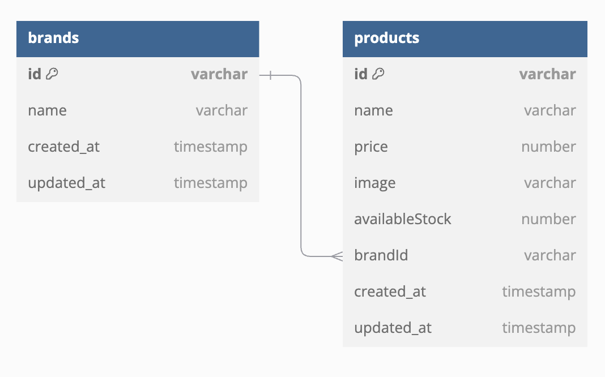

# counter-press-store

[Counter Press](https://amazingsafari.haidar.dev) online store for football shoes product

Table of Contents:

- [Counter Press](#counter-press)
  - [Links](#links)
  - [Features](#features)
  - [UI Designs](#ui-designs)
    - [Home Page](#home-page)

## Links

- Website/Frontend: <To Be Confirmed>
  - Backend: <To Be Confirmed>
- Repositories:
  - General: <https://github.com/difasulthon/counter-press-store>
  - Backend: <https://github.com/difasulthon/counter-press-backend>
  - Frontend: <https://github.com/difasulthon/counter-press-frontend>

Inspirations:

- <https://topscore.id/>
- <https://www.specs.id/>
- <https://www.ventela.com/>

## Features

- Home page
  - Hero section
  - Products catalogue. Example: <https://topscore.id/sepatu-bola>
- Product page
  - Image
  - SKU (stock keeping unit)
  - Name
  - Price
  - Description
  - Add to cart form: quantity input & add to cart button
- Shopping cart page
  - Product items to buy
    - Image, name, price, quantity, total (price x quantity)
    - Remove item
  - Link: continue shopping, go to products catalogue
  - Link: checkout
- Checkout page
  - Order summary
    - Product items to buy
    - Grand total of all product items to buy
- Place order / transaction is being processed

## UI Designs

- Figma: <https://www.figma.com/design/fQ3zoFPk66TK4WVqvtOm8s/CounterPressWeb?node-id=1-3&node-type=frame&t=EXrNZSUbP7B27P5k-0>

### Home Page


## Entity Relationship Diagram (ERD)



## REST API Endpoints

- Production: `https://amazingsafari.haidar.dev`
- Local: `http://localhost:3000`

| Endpoint         | HTTP     | Description               |
| ---------------- | -------- | ------------------------- |
| `/products`      | `GET`    | Get all products          |
| `/products/:id`  | `GET`    | Get product by id         |
| `/products/seed` | `POST`   | Seed all initial products |
| `/products`      | `POST`   | Add new product           |
| `/products`      | `DELETE` | Delete all products       |
| `/products/:id`  | `DELETE` | Delete product by id      |
| `/products/:id`  | `PUT`    | Update product by id      |

### Product

```json
{
  "id": 1,
  "name": "Specs",
  "price": 500000
}
```

### Add New Product

Request Body:

```json
{
  "name": "Ortuseight",
  "price": 500000,
  "brand": "Ortus"
}
```

Response Body:

```json
{
  "id": 1,
  "name": "Spec",
  "price": 500000,
  "brand": "Ortus"
}
```
